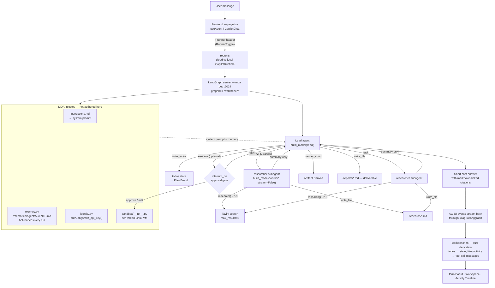

# Intelligence Workbench

A research-and-analysis console built on **LangChain Managed Deep Agents** (backend) and
**CopilotKit** (frontend) — an agentic system you interact with, built to exercise the full
capability surface of both stacks.

Give it a topic. It plans, delegates to a fleet of subagents, researches the web, runs Python
in a sandbox to compute and chart, writes artifacts to a virtual filesystem, and renders all of
it live — plan board, subagent timeline, file explorer, artifact canvas — while pausing for your
approval on anything expensive.

> **Status:** in active development. See [Roadmap](#roadmap).

---

## What runs where

Everything runs on your machine. There is no deploy-to-CopilotKit step — `CopilotRuntime` is an
npm library that runs *inside* the Next.js API route, not a hosted service.

```
YOUR MACHINE
┌──────────────────────────────────────────────────────────┐
│  browser → localhost:3000                                │
│                                                           │
│  ┌── Next.js (:3000) ─── npm run dev ─────────────────┐  │
│  │  React UI · CopilotChat · generative UI panels     │  │
│  │  CopilotRuntime  (library, in app/api/copilotkit)  │  │
│  └───────────────────────┬────────────────────────────┘  │
│                          │ LangGraph Server API           │
│  ┌── mda dev (:2024) ────▼────────────────────────────┐  │
│  │  MDA agent · tools · subagents · skills · sandbox  │  │
│  └────────────────────────────────────────────────────┘  │
└──────────────────────────────────────────────────────────┘
              │ outbound websocket — OPTIONAL
              ▼
   CopilotKit Intelligence (durable threads + Inspector)
```

Model provider keys stay in your processes and never reach CopilotKit.

**CopilotKit Intelligence is optional.** It's a persistence/observability layer — your agent
never executes there. `INTELLIGENCE_API_KEY` unset means only one mode ever exists —
`InMemoryAgentRunner`, nothing leaves your machine, history lost on restart. Set, both modes
exist and a pill in the app header (Local/Cloud) switches between them per session. **Local is
the default** — Cloud's gateway abandons a run after a 60s reconnect window, and runs here are
routinely minutes long:

| Mode | Runner | Result |
|---|---|---|
| Local (default) | `InMemoryAgentRunner` | Nothing leaves your machine. History lost on restart. No reconnect ceiling. |
| Cloud | `IntelligenceAgentRunner` | Durable threads, threads drawer, Inspector. History stored by CopilotKit. Drops long runs — see below. |

Switching **resets the visible conversation** — necessary, not a limitation: the client only
negotiates once per agent instance whether Intelligence is available and caches it for that
instance's lifetime, so the toggle forces a fresh instance (`key={mode}` on `<CopilotKit>`)
rather than trying to change transport mid-session, which doesn't work in this stack. Verified
live with `web/scripts/verify-toggle.mjs` (zero API cost — checks the negotiation re-fires
without sending a prompt).

---

## MDA Agentic Workflow

This is *this project's* decision flow, not MDA's in general — another MDA project wires its
middleware order, subagents, and tools differently. Keep this section current: whenever
`agent.py`, `middleware/`, `agent_core/subagents.py`, `tools/`, `sandbox/`, `memory.py`, or
`identity.py` changes in a way that changes the flow below, update this section in the same
change (see [CLAUDE.md](CLAUDE.md)).

### Request lifecycle



Every model call above — lead **and** subagents — passes through the same middleware stack in
`agent.py`, in this order, for reasons that matter (each one breaks if reordered):

| # | Middleware | What it does | Why this position |
|---|---|---|---|
| 1 | `CopilotKitMiddleware()` | Installs shared state + frontend-tool bridge | Must see the request before anything else touches it |
| 2 | `TodoListMiddleware()` | Contributes `write_todos` and the `todos` state field | Not provided by MDA or deepagents' default profile — verified by reading both; without it the Plan Board has no data source |
| 3 | `ProviderPromptMiddleware()` | Appends the active provider's prompt delta (`agent_core/prompts.py`) | Must run *after* anything else that contributes to the system prompt, so its addition is the final one. Runs per model call, so it reaches subagents too |
| 4 | `FriendlyErrorMiddleware()` | Catches provider failures, returns a readable `AIMessage` instead of aborting | Must wrap everything downstream of it — sits closer to the actual model call than the guards outside it |
| 5 | `call_limit()` (`ModelCallLimitMiddleware`) | Hard ceiling on total model calls for the run | Outermost — the last line of defense regardless of what happened above |

### The subagent math

- **Fan-out (breadth):** the lead decomposes the topic into 2-4 *distinct sub-questions* — different
  facets of the topic, not reworded versions of one question — and delegates one `researcher`
  subagent per sub-question. Several run in parallel because they're independent, not redundant.
  (`instructions.md`)
- **Search variance (recall):** each subagent, working its own single sub-question, runs 2-3
  searches with different phrasing before concluding — insurance against one query wording
  missing good results, not a way to cover more ground. (`RESEARCHER` in `agent_core/prompts.py`)
- **Per-search cap:** each `research()` call returns at most 6 sources (`tools/research.py`).
- Total ground covered ≈ subagents × searches-per-subagent × 6 — tune the first two multipliers
  in the files above; the source-per-call cap is the `max_results=6` line in `tools/research.py`.

### Why subagents don't stream token-by-token

`researcher` subagents are built with `build_model("worker", stream=False)`
(`agent_core/subagents.py`). deepagents runs subagents inline via `.invoke()`, not as a separate
subgraph, so their tokens would otherwise surface at the root of the run and interleave with the
lead's own streamed message when several run in parallel. Disabling streaming on subagent models
only fixes this; the lead still streams normally. Full incident writeup:
[docs/ARCHITECTURE.md §4d](docs/ARCHITECTURE.md).

### Steering — approvals and frontend tools

Two directions of control, both added in Milestone 6.

**The agent pauses for you.** `interrupt_on={"execute": …}` in `agent.py` gates the one tool
that runs arbitrary code. The round trip, verified against the installed packages rather than
the docs:

```
agent calls execute
  → HumanInTheLoopMiddleware raises a LangGraph interrupt carrying
      {action_requests: [{name, args, description}], review_configs: [{allowed_decisions}]}
  → @ag-ui/langgraph emits it as the `on_interrupt` custom event (JSON-stringified)
  → useInterrupt renders <ApprovalCard> inline in the chat
  → you click Approve / Edit / Reject
  → resolve({decisions: [...]}) → command.resume
  → interrupt(hitl_request)["decisions"] returns it; the run continues
```

`decisions` must contain **exactly one entry per action request, in order** — the middleware
raises on a count mismatch. Decision shapes: `{type:"approve"}`,
`{type:"reject", message?}`, `{type:"edit", edited_action:{name, args}}`.

> **Use `useInterrupt`, not `useHumanInTheLoop`.** They sound interchangeable and are not:
> `useHumanInTheLoop` registers a *frontend tool* whose handler happens to be a human, while
> `interrupt_on` uses LangGraph's interrupt mechanism. The giveaway is in the types —
> `INTERRUPT_EVENT_NAME` in `@copilotkit/react-core` is literally `"on_interrupt"`, the exact
> event `@ag-ui/langgraph` dispatches. Note also that `interrupt` is `null` on this path
> (it is the "legacy" custom-event flow), so the payload is read from `event.value`.

**You let the agent move the UI.** `useFrontendTool({name: "focus_panel", …})` registers a tool
that executes *in the browser*, not in the agent process, so the agent can switch the Sandbox
panel to Charts after rendering one, or open a file it just wrote — instead of describing where
to look. The panels read that state from `WorkbenchUIContext` rather than local state, which is
the whole reason it was lifted out of them.

### Who sees what — the sandbox/frontend visibility boundary

This is the part that trips people up: **the frontend never reads the sandbox filesystem, and
never reads LangGraph state beyond `todos`/`messages`.** The only two things that ever cross
from the agent process to the browser are a tool call's streamed **arguments** and its **result**
(text/JSON). Anything that happens purely as a side effect on the sandbox disk is invisible,
full stop — no matter how the UI is written, it cannot show what it was never told about.

Three scenarios, same rule, different outcomes:

```mermaid
flowchart TD
    subgraph S1["A — a text report (works today)"]
        direction LR
        A1["write_file(path, content=full text)"] --> A2["Argument IS the content —\nit crosses in the tool call"]
        A2 --> A3["Workspace panel renders it"]
    end

    subgraph S2["B — a chart image saved inside the sandbox (never worked, never will)"]
        direction LR
        B1["Script inside execute calls\nplt.savefig('/reports/chart.png')"] --> B2["Bytes land on the sandbox VM disk —\na plain file write, not a tool call"]
        B2 -.no tool call ever names this file.-> B3["❌ Frontend never learns\nthe file exists"]
    end

    subgraph S3["C — the chart tool (what milestone 5 built)"]
        direction LR
        C1["render_chart(spec={type, categories, series})"] --> C2["spec IS the argument —\ntiny JSON, not an image"]
        C2 --> C3["Artifact Canvas renders an\ninteractive chart from it"]
    end
```



| What | Crosses to the browser? | Why |
|---|---|---|
| A tool call's **arguments** | Yes — always | Streamed as the model generates them; this is how every panel gets its data |
| A tool call's **result** (text/JSON) | Yes — always | `execute`'s stdout, `research`'s sources, etc. |
| Sandbox disk contents | **No — never**, unless named in an argument or result | The sandbox VM's filesystem is not part of the AG-UI event stream at all |
| LangGraph state | Only `todos`, `messages`, `memory_contents`, `thread_model_call_count` | Confirmed by inspecting a compiled agent's state keys — see `docs/ARCHITECTURE.md` §4c |

This is also why the chart tool takes small structured numbers rather than an image: a chart
image would have to be base64-encoded into a `write_file` argument to be visible at all, which
means the model generates tens of thousands of output tokens for something that's really a
handful of numbers — the same visibility rule, just paid for the expensive way.

### File map — what governs each part of the flow

| File | Role |
|---|---|
| `agent.py` | Assembles model, tools, subagents, and middleware order. The only place that matters for *sequencing* |
| `agent_core/models.py` | Model selection by role (`lead`/`worker`/`cheap`) and provider — the only place model IDs appear |
| `agent_core/prompts.py` | `RESEARCHER` subagent prompt; per-provider `PROVIDER_DELTA` |
| `agent_core/subagents.py` | Subagent roster — currently one: `researcher` |
| `instructions.md` | The lead agent's system prompt — synced to Context Hub by MDA, not settable in `agent.py` |
| `tools/research.py` | Tavily search — the only tool subagents get |
| `tools/charts.py` | `render_chart` — structured chart data, lead-only (see "Who sees what" above for why it's structured, not an image) |
| `middleware/*.py` | See the ordered table above |
| `memory.py` | Declares the deployment-shared `/memories/agent/` tree — see the trust-boundary warning in the file itself |
| `identity.py` | Declares LangSmith-API-key auth for the deployment |
| `sandbox/__init__.py` | Declares the per-thread Linux VM that makes `execute` real |
| `web/src/app/api/copilotkit/[[...slug]]/route.ts` | Cloud/local runner dispatch on the `x-runner` header |
| `web/src/lib/workbench.ts` | Pure derivation of Plan Board / Workspace / Activity / Charts data from agent state and messages |
| `web/src/components/SandboxPanel.tsx` | Tabbed Console (`execute` output) + Artifact Canvas (charts) |
| `web/src/components/ApprovalCard.tsx` | The `interrupt_on` approval UI — parses the HITL request, emits `{decisions:[…]}` |
| `web/src/lib/workbench-ui.ts` | UI state the agent may drive (sandbox tab, open file), for the `focus_panel` frontend tool |

### Not wired yet

No `skills/` directory exists — the Skills Rail in the table below has nothing to show until one
is authored. No `schedules/`. Memory (`memory.py`) is active on the backend (the agent already
reads and writes `/memories/agent/AGENTS.md`, confirmed live in the Activity panel), but there
is no frontend Memory panel rendering it yet. All of this is tracked in [Roadmap](#roadmap).

---

## What it demonstrates

**Deep Agents**

| Capability | Where you see it |
|---|---|
| `write_todos` planning | Plan Board — live checklist, animates as todos flip status |
| Subagents | Subagent Timeline — swimlanes, nested tool calls |
| Virtual filesystem | File Explorer — tree, viewer, diff on `edit_file` |
| Skills (progressive disclosure) | Skills Rail — which `SKILL.md` activated, and when |
| Sandbox code execution | Console tab (Sandbox panel) — command + stdout/stderr per `execute` call |
| Structured chart output (`render_chart`) | Artifact Canvas tab (Sandbox panel) — interactive bar/line chart + table view |
| Human-in-the-loop (`interrupt_on`) | Approval Card — approve / edit / reject inline |
| Summarization + context offload | Context Meter — token gauge, marks each compaction |
| Durable memory (`AGENTS.md`) | Memory panel — what it carried across sessions |
| Managed schedules (cron) | Daily Brief card |

**CopilotKit**

`CopilotChat` · `useRenderToolCall` generative UI · `useFrontendTool` (the agent drives the app —
opens files, switches panels) · `useHumanInTheLoop` · shared state via `useAgent` ·
threads drawer · suggestions · Inspector.

**Provider-agnostic.** The same agent runs on Anthropic or OpenAI, switched by one env var, with
per-provider model tiering *and* per-provider prompt variants. A Cost Meter and a provider
toggle let you run the same question both ways and compare cost, latency, and output.

| Role | `LLM_PROVIDER=anthropic` | `LLM_PROVIDER=openai` |
|---|---|---|
| Lead (plan/synthesize) | `claude-opus-5` | `gpt-5.6-terra` |
| Worker (research/analyze) | `claude-sonnet-5` | `gpt-5.6-terra` @ effort `low` |
| Cheap (extract/classify) | `claude-haiku-4-5` | `gpt-5.6-luna` |

---

## Quickstart

**Prerequisites:** Python 3.14, Node 20+, [uv](https://docs.astral.sh/uv/) ≥ 0.12.

```bash
# 1. Install the Managed Deep Agents CLI (Python 3.10+ required)
uv tool install --python 3.14 managed-deepagents

# 2. Configure
cp .env.example .env      # then fill in your keys

# 3. Run the agent  (terminal 1)
cd agent && uv sync && mda dev .

# 4. Run the frontend  (terminal 2)
cd web && npm install && npm run dev
```

Open <http://localhost:3000>.

> **Note:** if you find older guidance telling you to install `managed-deepagents` with
> `--prerelease allow`, ignore it — stable releases exist, and because uv applies the flag
> globally it silently pulls `langchain` into an alpha. The current quickstart no longer
> recommends it.
>
> This quickstart also installs the CLI as a uv tool (pinning **its own** interpreter to
> 3.14) rather than the documented `uvx`/`uv run mda` form — under Python 3.9, uv resolves an
> ancient `mda` 0.4.0 that crashes on import. `uv run mda dev` works here too, since
> `managed-deepagents` is a project dependency as well.

---

## Roadmap

- [x] **0** — Transport spike: prove `mda dev` → CopilotKit
- [x] **1** — Repo scaffold, docs, git + remote
- [x] **2** — Agent core: dual-provider models + prompts, Tavily tool, first subagent<br>&nbsp;&nbsp;&nbsp;&nbsp;⚠️ verified end-to-end on Anthropic only — OpenAI blocked by `insufficient_quota` (account credits), not by code
- [x] **3** — Frontend shell talking to the agent end to end
- [x] **4** — Live panels: Plan Board, Workspace, Activity Timeline
- [x] **5** — Sandbox execution + charts + Artifact Canvas
- [x] **6** — Human-in-the-loop approvals, frontend tools
- [ ] **7** — Skills, memory, Context Meter, Cost Meter, provider toggle
- [ ] **8** — Managed layer: schedules, identity, `mda deploy`
- [ ] **9** — Design pass, screenshots, v0.1.0

---

## Documentation

- **[docs/ARCHITECTURE.md](docs/ARCHITECTURE.md)** — why it's built this way: the research, the
  rejected approaches, and what was verified by execution rather than assumed
- **[CLAUDE.md](CLAUDE.md)** — working conventions, run commands, MDA constraints, gotchas

### Upstream references

| | |
|---|---|
| Deep Agents | <https://docs.langchain.com/oss/python/deepagents/overview> |
| Managed Deep Agents | <https://docs.langchain.com/langsmith/python/managed-deep-agents-overview> |
| MDA authoring contract | <https://github.com/langchain-ai/langchain-skills/blob/main/config/skills/managed-deep-agents/SKILL.md> |
| CopilotKit | <https://docs.copilotkit.ai/> |
| CopilotKit Deep Agents | <https://docs.copilotkit.ai/deepagents> |

---

## License

MIT
