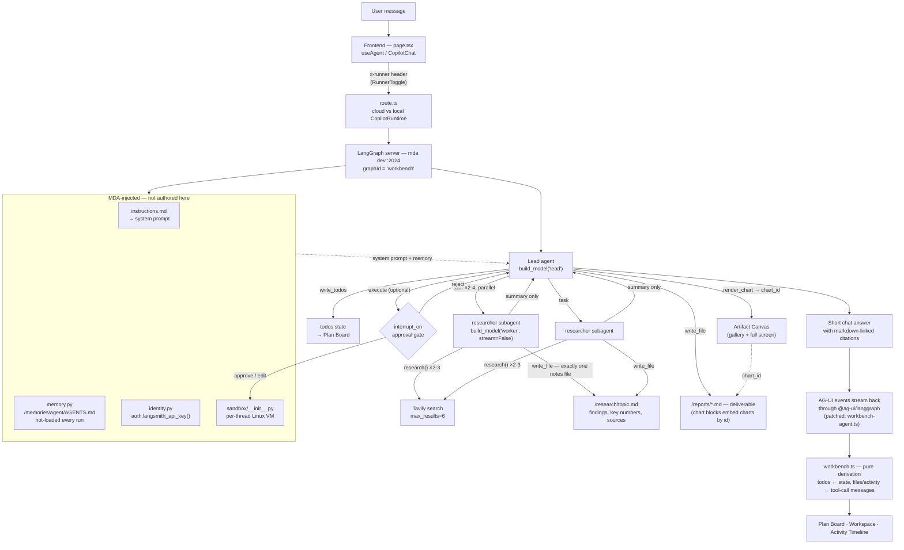
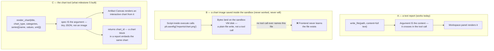
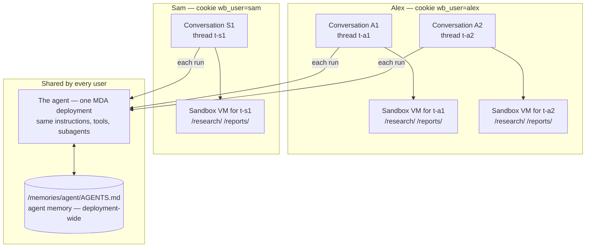
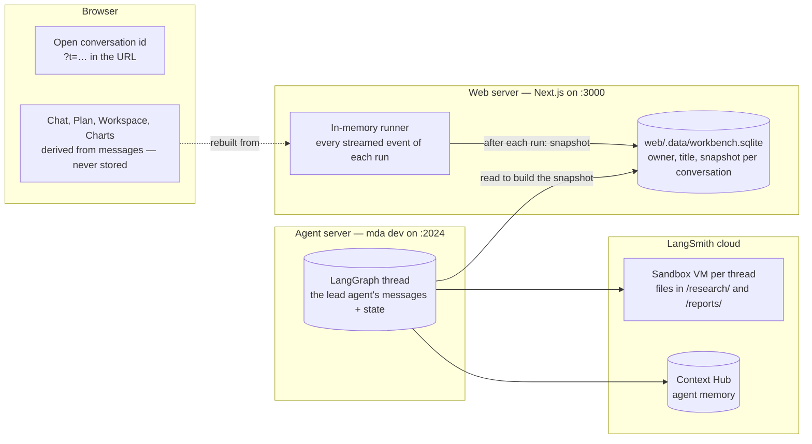
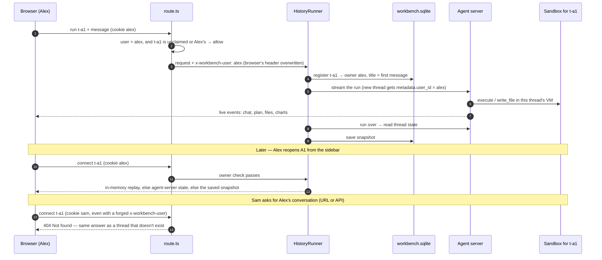
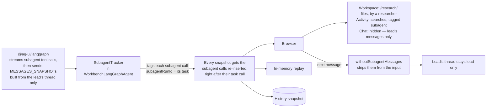
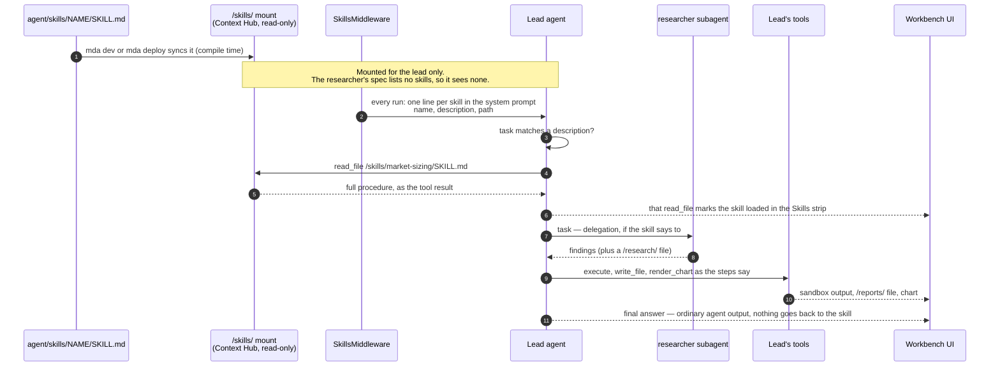

# Intelligence Workbench

A research-and-analysis console built on **LangChain Managed Deep Agents** (backend) and
**CopilotKit** (frontend) — an agentic system you interact with, built to exercise the full
capability surface of both stacks.

Give it a topic. It plans, delegates to a fleet of subagents, researches the web, runs Python
in a sandbox to compute and chart, writes artifacts to a virtual filesystem, and renders all of
it live — plan board, subagent timeline, file explorer, artifact canvas — while pausing for your
approval on anything expensive.

> **Status:** in active development. See [Roadmap](#roadmap).

---

## What runs where

Everything runs on your machine. There is no deploy-to-CopilotKit step — `CopilotRuntime` is an
npm library that runs *inside* the Next.js API route, not a hosted service.

```
YOUR MACHINE
┌──────────────────────────────────────────────────────────┐
│  browser → localhost:3000                                │
│                                                           │
│  ┌── Next.js (:3000) ─── npm run dev ─────────────────┐  │
│  │  React UI · CopilotChat · generative UI panels     │  │
│  │  CopilotRuntime  (library, in app/api/copilotkit)  │  │
│  └───────────────────────┬────────────────────────────┘  │
│                          │ LangGraph Server API           │
│  ┌── mda dev (:2024) ────▼────────────────────────────┐  │
│  │  MDA agent · tools · subagents · skills · sandbox  │  │
│  └────────────────────────────────────────────────────┘  │
└──────────────────────────────────────────────────────────┘
              │ outbound websocket — OPTIONAL
              ▼
   CopilotKit Intelligence (durable threads + Inspector)
```

Model provider keys stay in your processes and never reach CopilotKit.

**CopilotKit Intelligence is optional.** It's a persistence/observability layer — your agent
never executes there. `INTELLIGENCE_API_KEY` unset means only one mode ever exists —
`InMemoryAgentRunner`, nothing leaves your machine, history lost on restart. Set, both modes
exist and a pill in the app header (Local/Cloud) switches between them per session. **Local is
the default** — Cloud's gateway abandons a run after a 60s reconnect window, and runs here are
routinely minutes long:

| Mode | Runner | Result |
|---|---|---|
| Local (default) | `InMemoryAgentRunner` | Nothing leaves your machine. History lost on restart. No reconnect ceiling. |
| Cloud | `IntelligenceAgentRunner` | Durable threads, threads drawer, Inspector. History stored by CopilotKit. Drops long runs — see below. |

Switching **resets the visible conversation** — necessary, not a limitation: the client only
negotiates once per agent instance whether Intelligence is available and caches it for that
instance's lifetime, so the toggle forces a fresh instance (`key={mode}` on `<CopilotKit>`)
rather than trying to change transport mid-session, which doesn't work in this stack. Verified
live with `web/scripts/verify-toggle.mjs` (zero API cost — checks the negotiation re-fires
without sending a prompt). The chart and download UI has the same kind of check,
`web/scripts/verify-charts.mjs`, which answers the page's run request with a synthetic stream
instead of calling the agent.

---

## MDA Agentic Workflow

This is *this project's* decision flow, not MDA's in general — another MDA project wires its
middleware order, subagents, and tools differently. Keep this section current: whenever
`agent.py`, `middleware/`, `agent_core/subagents.py`, `tools/`, `sandbox/`, `memory.py`, or
`identity.py` changes in a way that changes the flow below, update this section in the same
change (see [CLAUDE.md](CLAUDE.md)).

### Request lifecycle


```mermaid
flowchart TD
    U["User message"] --> FE["Frontend — page.tsx\nuseAgent / CopilotChat"]
    FE -->|"x-runner header\n(RunnerToggle)"| RT["route.ts\ncloud vs local CopilotRuntime"]
    RT --> LG["LangGraph server — mda dev :2024\ngraphId = 'workbench'"]

    subgraph MDA["MDA-injected — not authored here"]
        SP["instructions.md\n→ system prompt"]
        MEM["memory.py\n/memories/agent/AGENTS.md\nhot-loaded every run"]
        ID["identity.py\nauth.langsmith_api_key()"]
        SB["sandbox/__init__.py\nper-thread Linux VM"]
    end
    LG --> MDA

    LG --> LEAD["Lead agent\nbuild_model('lead')"]
    MDA -. "system prompt + memory" .-> LEAD

    LEAD -->|"write_todos"| TODO["todos state\n→ Plan Board"]
    LEAD -->|"task ×2-4, parallel"| SUB1["researcher subagent\nbuild_model('worker', stream=False)"]
    LEAD -->|"task"| SUB2["researcher subagent"]
    SUB1 -->|"research() ×2-3"| TAV["Tavily search\nmax_results=6"]
    SUB2 -->|"research() ×2-3"| TAV
    SUB1 -->|"write_file — exactly one notes file"| RES["/research/topic.md\nfindings, key numbers, sources"]
    SUB2 -->|"write_file"| RES
    SUB1 -->|"summary only"| LEAD
    SUB2 -->|"summary only"| LEAD

    LEAD -->|"execute (optional)"| GATE{"interrupt_on\napproval gate"}
    GATE -->|"approve / edit"| SB
    GATE -->|"reject"| LEAD
    LEAD -->|"render_chart → chart_id"| CANVAS["Artifact Canvas\n(gallery + full screen)"]
    LEAD -->|"write_file"| REP["/reports/*.md — deliverable\n(chart blocks embed charts by id)"]
    CANVAS -.chart_id.-> REP
    LEAD --> ANS["Short chat answer\nwith markdown-linked citations"]

    ANS --> AGUI["AG-UI events stream back\nthrough @ag-ui/langgraph\n(patched: workbench-agent.ts)"]
    AGUI --> DERIVE["workbench.ts — pure derivation\ntodos ← state, files/activity ← tool-call messages"]
    DERIVE --> PANELS["Plan Board · Workspace · Activity Timeline"]
```

Every model call above — lead **and** subagents — passes through the same middleware stack in
`agent.py`, in this order, for reasons that matter (each one breaks if reordered):

| # | Middleware | What it does | Why this position |
|---|---|---|---|
| 1 | `CopilotKitMiddleware()` | Installs shared state + frontend-tool bridge | Must see the request before anything else touches it |
| 2 | `TodoListMiddleware()` | Contributes `write_todos` and the `todos` state field | Not provided by MDA or deepagents' default profile — verified by reading both; without it the Plan Board has no data source |
| 3 | `ProviderPromptMiddleware()` | Appends the run's provider's prompt delta (`agent_core/prompts.py`) | Must run *after* anything else that contributes to the system prompt, so its addition is the final one. Subagents don't inherit it — the researcher's spec lists it too |
| 4 | `FriendlyErrorMiddleware()` | Catches provider failures — including errors that arrive mid-stream as the SDK's own `APIError` — and returns a readable `AIMessage` naming the run's provider | Must wrap everything downstream of it — sits closer to the actual model call than the guards outside it |
| 5 | `call_limit()` (`ModelCallLimitMiddleware`) | Hard ceiling on total model calls for the run | The last line of defense regardless of what happened above |
| 6 | `ProviderSwitchMiddleware("lead")` | Swaps in the conversation's provider (`x-llm-provider`) per model call; strips Anthropic prompt-cache marks when switching away | Innermost, next to the model, so Friendly errors still wraps a failure on the swapped provider. The researcher has its own instance (`"worker"`, non-streaming) |

### The subagent math

- **Fan-out (breadth):** the lead decomposes the topic into 2-4 *distinct sub-questions* — different
  facets of the topic, not reworded versions of one question — and delegates one `researcher`
  subagent per sub-question. Several run in parallel because they're independent, not redundant.
  (`instructions.md`)
- **Search variance (recall):** each subagent, working its own single sub-question, runs 2-3
  searches with different phrasing before concluding — insurance against one query wording
  missing good results, not a way to cover more ground. (`RESEARCHER` in `agent_core/prompts.py`)
- **Per-search cap:** each `research()` call returns at most 6 sources (`tools/research.py`).
- Total ground covered ≈ subagents × searches-per-subagent × 6 — tune the first two multipliers
  in the files above; the source-per-call cap is the `max_results=6` line in `tools/research.py`.

### Why subagents don't stream token-by-token

`researcher` subagents are built with `build_model("worker", stream=False)`
(`agent_core/subagents.py`). deepagents runs subagents inline via `.invoke()`, not as a separate
subgraph, so their tokens would otherwise surface at the root of the run and interleave with the
lead's own streamed message when several run in parallel. Disabling streaming on subagent models
only fixes this; the lead still streams normally. Full incident writeup:
[docs/ARCHITECTURE.md §4d](docs/ARCHITECTURE.md).

### Steering — approvals and frontend tools

Two directions of control, both added in Milestone 6.

**The agent pauses for you.** `interrupt_on={"execute": …}` in `agent.py` gates the one tool
that runs arbitrary code. The round trip, verified against the installed packages rather than
the docs:

```
agent calls execute
  → HumanInTheLoopMiddleware raises a LangGraph interrupt carrying
      {action_requests: [{name, args, description}], review_configs: [{allowed_decisions}]}
      (description is generated per call by agent_core/approvals.describe_execute)
  → @ag-ui/langgraph emits it as the `on_interrupt` custom event (JSON-stringified)
  → useInterrupt renders <ApprovalCard> inline in the chat
  → you click Run it / Change it / Don't run
  → resolve({decisions: [...]}) → command.resume
  → interrupt(hitl_request)["decisions"] returns it; the run continues
```

**Written for people who don't read shell.** The approval text is not a fixed string: `description`
in `interrupt_on` is a function (`agent_core/approvals.py`) that builds a plain-language summary
per call, with no extra model call — a headline ("Run a short Python program."), the agent's own
stated reason taken from the message that carries the tool call, which workspace files it uses,
saves or deletes, and warnings for internet access, deletion or `sudo`. The card renders that,
explains what the sandbox is, and keeps the exact command behind "Show the exact command". It is a
summary, not a security boundary — the sandbox is what contains the command. Verified with
`web/scripts/verify-approval.mjs` (synthetic interrupt, zero API cost), which also checks the
resume payload for all three decisions.

`decisions` must contain **exactly one entry per action request, in order** — the middleware
raises on a count mismatch. Decision shapes: `{type:"approve"}`,
`{type:"reject", message?}`, `{type:"edit", edited_action:{name, args}}`.

> **Use `useInterrupt`, not `useHumanInTheLoop`.** They sound interchangeable and are not:
> `useHumanInTheLoop` registers a *frontend tool* whose handler happens to be a human, while
> `interrupt_on` uses LangGraph's interrupt mechanism. The giveaway is in the types —
> `INTERRUPT_EVENT_NAME` in `@copilotkit/react-core` is literally `"on_interrupt"`, the exact
> event `@ag-ui/langgraph` dispatches. Note also that `interrupt` is `null` on this path
> (it is the "legacy" custom-event flow), so the payload is read from `event.value`.

**You let the agent move the UI.** `useFrontendTool({name: "focus_panel", …})` registers a tool
that executes *in the browser*, not in the agent process, so the agent can switch the Sandbox
panel to Charts after rendering one, or open a file it just wrote — instead of describing where
to look. The panels read that state from `WorkbenchUIContext` rather than local state, which is
the whole reason it was lifted out of them.

### Who sees what — the sandbox/frontend visibility boundary

This is the part that trips people up: **the frontend never reads the sandbox filesystem, and
never reads LangGraph state beyond `todos`/`messages`.** The only two things that ever cross
from the agent process to the browser are a tool call's streamed **arguments** and its **result**
(text/JSON). Anything that happens purely as a side effect on the sandbox disk is invisible,
full stop — no matter how the UI is written, it cannot show what it was never told about.

Three scenarios, same rule, different outcomes:


```mermaid
flowchart TD
    subgraph S1["A — a text report (works today)"]
        direction LR
        A1["write_file(path, content=full text)"] --> A2["Argument IS the content —\nit crosses in the tool call"]
        A2 --> A3["Workspace panel renders it"]
    end

    subgraph S2["B — a chart image saved inside the sandbox (never worked, never will)"]
        direction LR
        B1["Script inside execute calls\nplt.savefig('/reports/chart.png')"] --> B2["Bytes land on the sandbox VM disk —\na plain file write, not a tool call"]
        B2 -.no tool call ever names this file.-> B3["❌ Frontend never learns\nthe file exists"]
    end

    subgraph S3["C — the chart tool (what milestone 5 built)"]
        direction LR
        C1["render_chart(title, chart_type, categories, series[{name, values, unit}])"] --> C2["spec IS the argument —\ntiny JSON, not an image"]
        C2 --> C3["Artifact Canvas renders an\ninteractive chart from it"]
        C2 --> C4["returns chart_id — a chart block\nin a report embeds the same chart"]
    end
```

| What | Crosses to the browser? | Why |
|---|---|---|
| A tool call's **arguments** | Yes — always | Streamed as the model generates them; this is how every panel gets its data |
| A tool call's **result** (text/JSON) | Yes — always | `execute`'s stdout, `research`'s sources, etc. |
| Sandbox disk contents | **No — never**, unless named in an argument or result | The sandbox VM's filesystem is not part of the AG-UI event stream at all |
| LangGraph state | Only `todos`, `messages`, `memory_contents`, `thread_model_call_count` | Confirmed by inspecting a compiled agent's state keys — see `docs/ARCHITECTURE.md` §4c |

This is also why the chart tool takes small structured numbers rather than an image: a chart
image would have to be base64-encoded into a `write_file` argument to be visible at all, which
means the model generates tens of thousands of output tokens for something that's really a
handful of numbers — the same visibility rule, just paid for the expensive way.

### Provider toggle — Anthropic or OpenAI, per conversation

The header's **Anthropic | OpenAI** switch picks the provider for a conversation. The agent is
defined once; each request carries `x-llm-provider`, which CopilotKit's adapter forwards into the
run's config and deepagents passes on to subagents. `ProviderSwitchMiddleware` swaps the model
per call to the same *role* from that provider's profile (`agent_core/models.py`), and the prompt
delta follows. When switching away from Anthropic it also strips the three prompt-cache marks
deepagents' Anthropic caching middleware added (model settings, system block, last tool) — that
middleware runs outside ours and only ever saw the Anthropic model.

A conversation **keeps the provider it started on**: the history store records it at the first
run and `route.ts` enforces it on every later request, because provider-specific history (e.g.
Anthropic thinking blocks) doesn't carry across. So switching starts a new conversation — ask the
same question on both, and compare them in the sidebar (OpenAI conversations carry a badge) with
the Cost meter. `LLM_PROVIDER` in `.env` is only the default when no header is sent.

Verified: offline (both roles, case-insensitive header, bogus value falls back, cache marks
stripped), `web/scripts/verify-provider.mjs` (zero API cost), and live — an OpenAI conversation
reached OpenAI's Responses API, which answered "You have no credits remaining"; that is the
account, not the code. That same run found `FriendlyErrorMiddleware` letting mid-stream SDK errors
through (a blank reply) and naming the `.env` provider instead of the run's — both fixed.

### Users and history — who owns what

Demo sign-in: pick one of three users, no password (`web/src/lib/users.ts`). The choice is an
httpOnly cookie that only the server reads. Real identity is Milestone 8 — MDA 0.8 supports
Supabase logins directly via `auth.supabase(...)` in `identity.py`.

#### 1. Who owns what

Every box inside a user's area belongs to that user alone. The only thing all users share is
the agent itself — and its memory.


```mermaid
flowchart TB
    subgraph ALEX["Alex — cookie wb_user=alex"]
        direction TB
        A1["Conversation A1<br/>thread t-a1"] --> VA1["Sandbox VM for t-a1<br/>/research/  /reports/"]
        A2["Conversation A2<br/>thread t-a2"] --> VA2["Sandbox VM for t-a2<br/>/research/  /reports/"]
    end
    subgraph SAM["Sam — cookie wb_user=sam"]
        direction TB
        S1["Conversation S1<br/>thread t-s1"] --> VS1["Sandbox VM for t-s1<br/>/research/  /reports/"]
    end
    subgraph SHARED["Shared by every user"]
        direction TB
        AG["The agent — one MDA deployment<br/>same instructions, tools, subagents"]
        MEM[("/memories/agent/AGENTS.md<br/>agent memory — deployment-wide")]
        AG <--> MEM
    end
    A1 & A2 & S1 -->|"each run"| AG
```

- A **sandbox belongs to a conversation, not to a user** — MDA scopes it per thread and accepts
  no other scope. Alex's two conversations are two different machines; "Alex's files" means
  "the files in Alex's conversations".
- **Agent memory is the exception**: one `/memories/agent/` tree for every caller, so nothing
  personal may go there (`memory.py`, `instructions.md`). MDA 0.8's per-user memory layer is
  not enabled — it only mounts for verified identities (Milestone 8).

#### 2. Where each piece lives, and what erases it


```mermaid
flowchart LR
    subgraph BROWSER["Browser"]
        URL["Open conversation id<br/>?t=… in the URL"]
        PANELS["Chat, Plan, Workspace, Charts<br/>derived from messages — never stored"]
    end
    subgraph WEB["Web server — Next.js on :3000"]
        MEMRUN["In-memory runner<br/>every streamed event of each run"]
        DB[("web/.data/workbench.sqlite<br/>owner, title, snapshot per conversation")]
    end
    subgraph AGENT["Agent server — mda dev on :2024"]
        LG[("LangGraph thread<br/>the lead agent's messages + state")]
    end
    subgraph REMOTE["LangSmith cloud"]
        VM["Sandbox VM per thread<br/>files in /research/ and /reports/"]
        HUB[("Context Hub<br/>agent memory")]
    end
    MEMRUN -->|"after each run: snapshot"| DB
    LG -->|"read to build the snapshot"| DB
    PANELS -.->|"rebuilt from"| MEMRUN
    LG --> VM
    LG --> HUB
```

| Piece | Lives in | Erased by |
|---|---|---|
| Open conversation | Browser URL | nothing — it is just an id |
| Streamed events of each run | Web server memory | restarting `npm run dev` |
| **History (owner, title, snapshot)** | `web/.data/workbench.sqlite` | deleting the conversation, or the file |
| The lead agent's thread | Agent server | locally: every `mda dev` restart or `mda build .` (see ARCHITECTURE §4d). Deployed: durable |
| Files in `/research/`, `/reports/` | Sandbox VM | 10 idle minutes (`idle_ttl_seconds=600`) |
| Agent memory | Context Hub | never by a deploy — only by editing it |

Reports and charts outlive their sandbox because the Workspace and Charts panels are rebuilt from
the saved *messages* (the `write_file` and `render_chart` arguments), not read from the VM.

#### 3. One conversation, end to end — and another user trying to open it


```mermaid
sequenceDiagram
    autonumber
    participant B as Browser (Alex)
    participant R as route.ts
    participant H as HistoryRunner
    participant DB as workbench.sqlite
    participant A as Agent server
    participant V as Sandbox for t-a1
    B->>R: run t-a1 + message (cookie alex)
    R->>R: user = alex, and t-a1 is unclaimed or Alex's → allow
    R->>H: request + x-workbench-user: alex (browser's header overwritten)
    H->>DB: register t-a1 → owner alex, title = first message
    H->>A: stream the run (new thread gets metadata.user_id = alex)
    A->>V: execute / write_file in this thread's VM
    A-->>B: live events: chat, plan, files, charts
    H->>A: run over → read thread state
    H->>DB: save snapshot
    Note over B,V: Later — Alex reopens A1 from the sidebar
    B->>R: connect t-a1 (cookie alex)
    R->>H: owner check passes
    H-->>B: in-memory replay, else agent-server state, else the saved snapshot
    Note over B,V: Sam asks for Alex's conversation (URL or API)
    B->>R: connect t-a1 (cookie sam, even with a forged x-workbench-user)
    R-->>B: 404 Not found — same answer as a thread that doesn't exist
```

#### 4. How subagent work is kept — it would otherwise vanish

Each researcher writes exactly one `/research/<topic>.md` notes file (findings, key numbers,
sources — the evidence behind the report) and runs its own searches. None of that is in the
lead's LangGraph thread, because deepagents runs a subagent inline inside the lead's `task` call.


```mermaid
flowchart LR
    ADAPTER["@ag-ui/langgraph<br/>streams subagent tool calls,<br/>then sends MESSAGES_SNAPSHOTs<br/>built from the lead's thread only"] --> TRACK["SubagentTracker<br/>in WorkbenchLangGraphAgent"]
    TRACK -->|"tags each subagent call<br/>subagentRunId = its task"| OUT["Every snapshot gets the<br/>subagent calls re-inserted,<br/>right after their task call"]
    OUT --> UI["Browser"]
    OUT --> MEM["In-memory replay"]
    OUT --> DB[("History snapshot")]
    UI --> PANELS["Workspace: /research/ files, by a researcher<br/>Activity: searches, tagged subagent<br/>Chat: hidden — lead's messages only"]
    UI -->|"next message"| STRIP["withoutSubagentMessages<br/>strips them from the input"]
    STRIP --> LEADTHREAD["Lead's thread stays lead-only"]
```

Without the tracker, `@ag-ui/client` — which treats a snapshot as the complete message list —
erased subagent searches and files at the next snapshot, and they never reached history. The
inbound strip matters just as much: the adapter sends every client message its thread doesn't
hold as new input, so re-inserted subagent calls would otherwise be written into the lead's
thread on the next turn. Verified on a recorded real run (55 researcher calls kept, next-turn
input 135 → 25 messages) and with `web/scripts/verify-subagents.mjs` (zero API cost).

- **Each conversation already has its own sandbox** — MDA scopes the sandbox per thread (the
  only scope it accepts), so "per-user folders" is really "per-user conversations": `/reports/`
  in Alex's conversation and in Sam's are different machines. The sandbox is also temporary
  (reclaimed after 10 idle minutes), so it is never where history lives.
- **History is the conversation, not the disk.** Reports and charts are rebuilt from the saved
  messages (the `write_file` / `render_chart` arguments), so reopening a conversation restores
  its chat, plan, files and charts even after its sandbox is gone. Continuing an old conversation
  gets a fresh sandbox; the agent still sees the whole conversation.
- **Why the web app keeps its own copy:** under `mda dev`, LangGraph's thread persistence lives in
  `agent/.mda/build/`, which `mda dev` and `mda build` both empty before compiling — every agent
  restart erases local threads. A deployed MDA agent has durable threads; the SQLite store is what
  makes history survive on a laptop.
- **Ownership is enforced server-side**: `/api/threads` lists only the cookie's user, and
  `route.ts` answers 404 to run / connect / stop on someone else's thread — verified including a
  spoofed `x-workbench-user` header.
- History is kept for **Local** mode. Cloud mode stores conversations in CopilotKit Intelligence.

Verified with `web/scripts/verify-history.mjs` (seeded conversations, zero API cost) plus one
single-call live run confirming registration, the post-run snapshot, and `user_id` on the agent
thread.

### File map — what governs each part of the flow

| File | Role |
|---|---|
| `agent.py` | Assembles model, tools, subagents, and middleware order. The only place that matters for *sequencing* |
| `agent_core/models.py` | Model selection by role (`lead`/`worker`/`cheap`) and provider — the only place model IDs appear. `run_provider()` reads the conversation's provider from the run's forwarded headers |
| `middleware/provider_switch.py` | Per-call model swap to the conversation's provider — see § Provider toggle |
| `agent_core/prompts.py` | `RESEARCHER` subagent prompt; per-provider `PROVIDER_DELTA` |
| `agent_core/subagents.py` | Subagent roster — currently one: `researcher` |
| `instructions.md` | The lead agent's system prompt — synced to Context Hub by MDA, not settable in `agent.py` |
| `tools/research.py` | Tavily search — the only tool subagents get |
| `tools/charts.py` | `render_chart` — structured chart data, lead-only (see "Who sees what" above for why it's structured, not an image). Returns a `chart_id`; series carry a `unit`, and different units are drawn as separate panels, never one shared axis. `chart_slug` must match `chartSlug` in `web/src/lib/workbench.ts` |
| `middleware/*.py` | See the ordered table above |
| `skills/<name>/SKILL.md` | Procedures the lead loads when a task matches — see § Skills. Frontmatter `name` must equal the directory name |
| `memory.py` | Declares the deployment-shared `/memories/agent/` tree — see the trust-boundary warning in the file itself |
| `identity.py` | Declares LangSmith-API-key auth for the deployment |
| `sandbox/__init__.py` | Declares the per-thread Linux VM that makes `execute` real |
| `web/src/app/api/copilotkit/[[...slug]]/route.ts` | Sign-in and ownership checks, then Cloud/local runner dispatch on the `x-runner` header |
| `web/src/lib/workbench.ts` | Pure derivation of Plan Board / Workspace / Activity / Charts data from agent state and messages |
| `web/src/components/SandboxPanel.tsx` | Tabbed Console (`execute` output) + Artifact Canvas (chart gallery) |
| `web/src/components/charts/` | One chart renderer (`ChartPlot`: unit panels, wrapped labels) shared by the gallery, the full-screen view (`ChartDialog`: all charts, table, PNG/SVG/CSV export) and charts embedded in reports |
| `web/src/lib/downloads.ts` | Client-side downloads — report files, chart PNG/SVG/CSV; "Save as PDF" is the browser's print, via a print-only copy of the report |
| `agent_core/approvals.py` | Plain-language approval text for `execute` — the `interrupt_on` description function |
| `web/src/components/ApprovalCard.tsx` | The `interrupt_on` approval UI — renders the plain-language description, emits `{decisions:[…]}` |
| `web/src/lib/usage-tracker.ts`, `web/src/lib/pricing.ts` | Context and Cost meters: per-call usage from each model call's own report, carried in agent state as `workbenchUsage`; verified prices applied in the browser |
| `web/src/lib/subagent-tracker.ts` | Keeps subagent tool calls through message snapshots (outbound) and out of the lead's thread (inbound) — see "How subagent work is kept" |
| `web/src/lib/workbench-ui.ts` | UI state the agent may drive (sandbox tab, open file, expanded chart), for the `focus_panel` frontend tool |
| `web/src/lib/users.ts`, `web/src/components/SessionGate.tsx` | Demo sign-in; owns the open conversation id (`?t=` in the URL) and hands it to `<CopilotKit threadId>` |
| `web/src/lib/server/history-runner.ts`, `history-store.ts` | Per-user history: registers and snapshots conversations, restores them on reopen |
| `web/src/components/HistorySidebar.tsx` | The conversation list — grouped by date, rename, delete |

### Not wired yet

No `schedules/` yet — tracked in [Roadmap](#roadmap).

### Memory

`memory.py` enables the deployment-wide agent layer: `/memories/agent/AGENTS.md` is loaded into
every run for every user. The **Memory** tab on the Workspace panel shows what is stored now and
what the open conversation changed (its `write_file` / `edit_file` calls on `/memories/`, which
are kept out of the Files list), under a notice that memory is shared. Locally it reads
`agent/.mda/__contexthub__/memories/agent/` — MDA's stand-in for LangSmith Context Hub, outside
`.mda/build/`, so compiles don't erase it; for a deployed agent the tab shows only the
conversation's changes. As of 2026-09-26 the agent has read memory but **never saved anything**
(the file is empty) — earlier notes here claiming it writes memory overstated it. Verified with
`web/scripts/verify-memory.mjs` (zero API cost).

### Skills

`agent/skills/<name>/SKILL.md` — three so far: `competitive-analysis`, `market-sizing`,
`data-analysis`. MDA mounts the folder read-only at `/skills/` for the **lead agent only**
(subagents get skills only if their spec lists them), and deepagents' `SkillsMiddleware` lists
each skill's name and description in the system prompt. The agent reads the full `SKILL.md`
only when a task matches — progressive disclosure, so an unused skill costs a line of prompt, not
the whole procedure. The Skills strip on the Plan panel shows both halves: every available skill
(`/api/skills` reads the frontmatter from the repo) and the ones this conversation loaded (a
`read_file` on `/skills/<name>/…`). Skills are discovered at compile time — restart `mda dev`
after adding one. Verified with one live two-call run: the agent opened
`/skills/market-sizing/SKILL.md` and the strip marked it loaded.

**A skill is instructions, not code or an agent.** It has no tools of its own, never calls
anything, and nothing returns to it. The agent that reads it follows the steps with the tools it
already has — so a skill that names `execute` or `task` works only because the lead has tools by
those names. deepagents parses an `allowed-tools` frontmatter field but only prints it in the
prompt as a hint; it restricts nothing.


```mermaid
sequenceDiagram
    autonumber
    participant Repo as agent/skills/NAME/SKILL.md
    participant Hub as /skills/ mount<br/>(Context Hub, read-only)
    participant MW as SkillsMiddleware
    participant Lead as Lead agent
    participant R as researcher subagent
    participant T as Lead's tools
    participant UI as Workbench UI

    Repo->>Hub: mda dev or mda deploy syncs it (compile time)
    Note over Hub,Lead: Mounted for the lead only.<br/>The researcher's spec lists no skills, so it sees none.
    MW->>Lead: every run: one line per skill in the system prompt<br/>name, description, path
    Lead->>Lead: task matches a description?
    Lead->>Hub: read_file /skills/market-sizing/SKILL.md
    Hub-->>Lead: full procedure, as the tool result
    Lead-->>UI: that read_file marks the skill loaded in the Skills strip
    Lead->>R: task — delegation, if the skill says to
    R-->>Lead: findings (plus a /research/ file)
    Lead->>T: execute, write_file, render_chart as the steps say
    T-->>UI: sandbox output, /reports/ file, chart
    Lead-->>UI: final answer — ordinary agent output, nothing goes back to the skill
```

| Name a skill can use | Where the lead gets it |
|---|---|
| `research`, `render_chart` | Our tools, `agent.py` |
| `ls`, `read_file`, `write_file`, `edit_file`, `glob`, `grep`, `execute` | deepagents' filesystem middleware. `execute` runs shell commands in the thread's sandbox VM (`sandbox/`) and is gated by the approval card |
| `task` | deepagents' subagent middleware — delegation to `researcher` |
| `write_todos` | `TodoListMiddleware`, added in `agent.py` |
| `focus_panel` | Frontend tool from the web app (CopilotKit) |

---

## What it demonstrates

**Deep Agents**

| Capability | Where you see it |
|---|---|
| `write_todos` planning | Plan Board — live checklist, animates as todos flip status |
| Subagents | Subagent Timeline — swimlanes, nested tool calls |
| Virtual filesystem | File Explorer — tree, viewer, diff on `edit_file` |
| Skills (progressive disclosure) | Skills strip (Plan panel) — every available skill, and which ones this conversation loaded |
| Sandbox code execution | Console tab (Sandbox panel) — command + stdout/stderr per `execute` call |
| Structured chart output (`render_chart`) | Artifact Canvas tab (Sandbox panel) — gallery of every chart, full-screen view with table + PNG/SVG/CSV export, and live charts embedded in reports (downloadable as `.md` or PDF) |
| Human-in-the-loop (`interrupt_on`) | Approval Card — approve / edit / reject inline |
| Summarization + context offload | Context Meter (header) — the lead's current context against its model's window, per-call growth chart, compactions counted |
| Per-call token usage | Cost Meter (header) — estimated spend for the conversation, split by model and lead vs subagents, cache reads/writes priced at their own rates |
| Durable memory (`AGENTS.md`) | Memory tab (Workspace panel) — what is stored, what this conversation changed, and that it is shared |
| Managed schedules (cron) | Daily Brief card |

**CopilotKit**

`CopilotChat` · `useRenderToolCall` generative UI · `useFrontendTool` (the agent drives the app —
opens files, switches panels) · `useHumanInTheLoop` · shared state via `useAgent` ·
threads drawer · suggestions · Inspector.

**Provider-agnostic.** The same agent runs on Anthropic or OpenAI, switched by one env var, with
per-provider model tiering *and* per-provider prompt variants. A Cost Meter and a provider
toggle let you run the same question both ways and compare cost, latency, and output.

| Role | `LLM_PROVIDER=anthropic` | `LLM_PROVIDER=openai` |
|---|---|---|
| Lead (plan/synthesize) | `claude-opus-5` | `gpt-5.6-terra` |
| Worker (research/analyze) | `claude-sonnet-5` | `gpt-5.6-terra` @ effort `low` |
| Cheap (extract/classify) | `claude-haiku-4-5` | `gpt-5.6-luna` |

---

## Quickstart

**Prerequisites:** Python 3.14, Node 20+, [uv](https://docs.astral.sh/uv/) ≥ 0.12.

```bash
# 1. Install the Managed Deep Agents CLI (Python 3.10+ required)
uv tool install --python 3.14 managed-deepagents

# 2. Configure
cp .env.example .env      # then fill in your keys

# 3. Run the agent  (terminal 1)
cd agent && uv sync && mda dev .

# 4. Run the frontend  (terminal 2)
cd web && npm install && npm run dev
```

Open <http://localhost:3000>.

> **Note:** if you find older guidance telling you to install `managed-deepagents` with
> `--prerelease allow`, ignore it — stable releases exist, and because uv applies the flag
> globally it silently pulls `langchain` into an alpha. The current quickstart no longer
> recommends it.
>
> This quickstart also installs the CLI as a uv tool (pinning **its own** interpreter to
> 3.14) rather than the documented `uvx`/`uv run mda` form — under Python 3.9, uv resolves an
> ancient `mda` 0.4.0 that crashes on import. `uv run mda dev` works here too, since
> `managed-deepagents` is a project dependency as well.

---

## Roadmap

- [x] **0** — Transport spike: prove `mda dev` → CopilotKit
- [x] **1** — Repo scaffold, docs, git + remote
- [x] **2** — Agent core: dual-provider models + prompts, Tavily tool, first subagent<br>&nbsp;&nbsp;&nbsp;&nbsp;⚠️ verified end-to-end on Anthropic only — OpenAI blocked by `insufficient_quota` (account credits), not by code
- [x] **3** — Frontend shell talking to the agent end to end
- [x] **4** — Live panels: Plan Board, Workspace, Activity Timeline
- [x] **5** — Sandbox execution + charts + Artifact Canvas
- [x] **6** — Human-in-the-loop approvals, frontend tools
- [x] **7** — Skills, memory, Context Meter, Cost Meter, provider toggle
- [ ] **8** — Managed layer: schedules, identity, `mda deploy`
- [ ] **9** — Design pass, screenshots, v0.1.0

---

## Documentation

- **[docs/ARCHITECTURE.md](docs/ARCHITECTURE.md)** — why it's built this way: the research, the
  rejected approaches, and what was verified by execution rather than assumed
- **[CLAUDE.md](CLAUDE.md)** — working conventions, run commands, MDA constraints, gotchas

### Upstream references

| | |
|---|---|
| Deep Agents | <https://docs.langchain.com/oss/python/deepagents/overview> |
| Managed Deep Agents | <https://docs.langchain.com/langsmith/python/managed-deep-agents-overview> |
| MDA authoring contract | <https://github.com/langchain-ai/langchain-skills/blob/main/config/skills/managed-deep-agents/SKILL.md> |
| CopilotKit | <https://docs.copilotkit.ai/> |
| CopilotKit Deep Agents | <https://docs.copilotkit.ai/deepagents> |

---

## License

MIT
